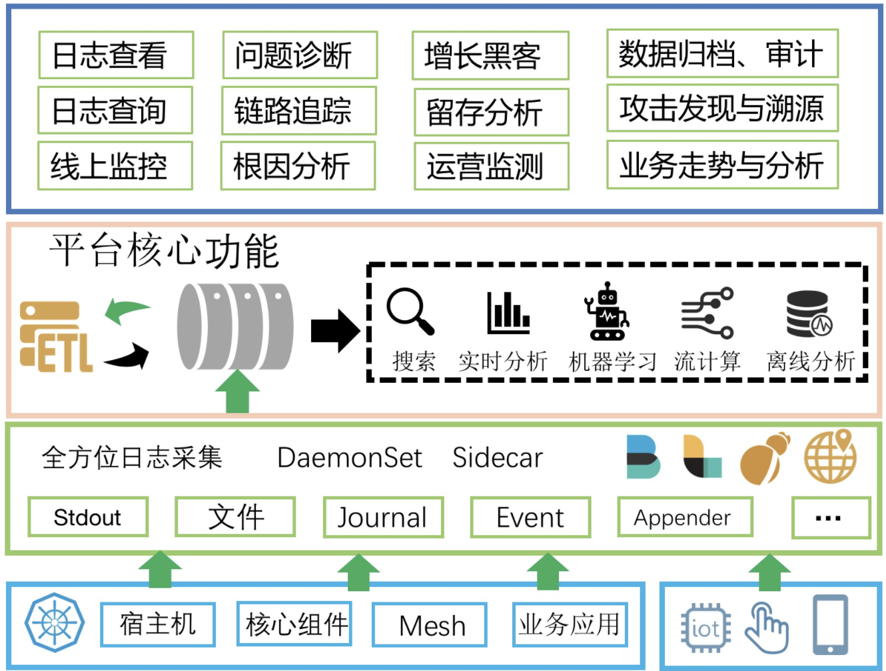
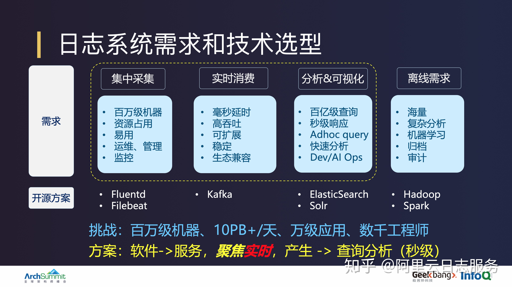
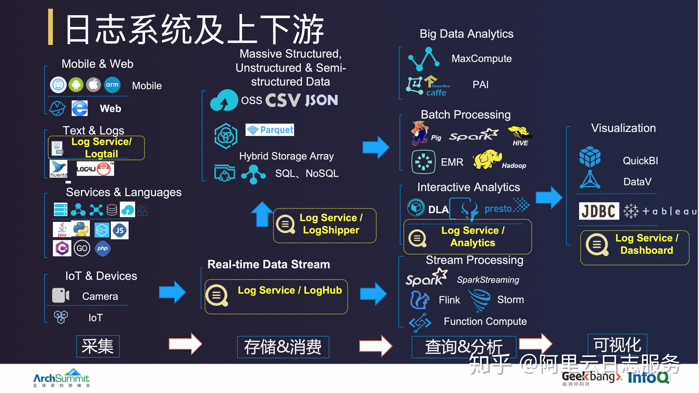

# 日志系统

## 需求分析

- 1 支持各种日志格式、数据源的采集，包括非K8s
- 2 能够快速的查找/定位问题日志
- 3 能够将各种格式的半结构化/非结构化日志格式化，并支持快速的统计分析、可视化
- 4 支持通过日志进行实时计算并获得一些业务指标，并支持基于业务指标实时的告警（其实本质就是APM）
- 5 支持对于超大规模的日志进行各种维度的关联分析，可接受一定时间的延迟
- 6 能够便捷的对接各种外部系统或支持自定义的获取数据，例如对接第三方审计系统
- 7 能够基于日志以及相关的时序信息，实现智能的告警、预测、根因分析等，并能够支持自定义的离线训练方式以获得更好的效果

## 技术选型

## 痛点

当我们把这套系统部署好，能够把日志从容器上采集上来、elasticsearch上能够查到、Hadoop上能够成功执行SQL、Grafana上能看到图、告警短信能收到......完成上述流程打通后，加加班可能只需要花费几天的时间，当系统终于跑通的时候，这时候终于可以长舒一口气，躺在办公椅上放松放松。

- 随着业务量的上涨，日志量也越来越大，Kakfa和ES要不断扩容，同时同步Kafka到ES的Connector也需要扩容，最烦的是采集Agent，每台机器上部署的DaemonSet Fluentd根本没办法扩容，到了单Agent瓶颈就没办法了，只能换Sidecar，换Sidecar工作量大不说，还会带来一系列其他的问题，比如怎么和CICD系统集成、资源消耗、配置规划、stdout采集不支持等等。
- 从刚开始上的边缘业务，慢慢更多的核心业务接入，对于日志的可靠性要求越来越高，经常有研发反应从ES上查不到数据、运营说统计出来的报表不准、安全说拿到的数据不是实时的......每次问题的排查都要经过采集、队列、清洗、传输等等非常多的路径，排查代价非常高。同时还要为日志系统搭建一套监控方案，能够即时发现问题，而且这套方案还不能基于日志系统，不能自依赖。
- 当越来越多的开发开始用日志平台调查问题时，经常会出现因为某1-2个人提交一个大的查询，导致系统整体负载上升，其他人的查询都会被Block，甚至出现Full GC等情况。这时候一些大能力的公司会对ES进行改造，来支持多租户隔离；或者为不同的业务部门搭建不同的ES集群，最后又要运维多个ES集群，工作量还是很大。
- 当投入了很多人力，终于能够把日志平台维持日常使用，这时候公司财务找过来了，说我们用了非常多的机器，成本太大。这时候开始要优化成本，但是思来想去就是需要这么多台机器，每天大部分的机器水位都在20%-30%，但是高峰的水位可能到70%，所以不能撤，撤了高峰顶不住，这时候只能搞搞削峰填谷，又是一堆工作量。

## 日志系统及上下游

## 如何有效落地生产环境

- 1 K8s上以什么样的姿势来打日志？
- 2 K8s上的日志采集方案选择，DaemonSet or Sidecar？
- 3 日志方案如何与CICD去集成？
- 4 微服务下各个应用的日志存储如何划分
- 5 如何基于K8s系统的日志去做K8s监控？
- 6 如何去监控日志平台的可靠性？
- 7 如何去对多个微服务/组件去做自动的巡检？
- 8 如何自动的监控多个站点并实现流量异常时的快速定位？